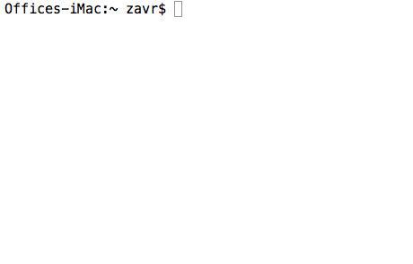
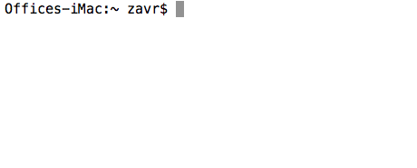
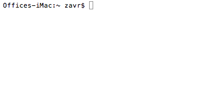

# expensive

[](https://npmjs.org/package/expensive)

`expensive` is a [namecheap.com](https://namecheap.com) client to check domain availability, register domains, create Route 53 record zones and control domains' name servers via the CLI. The package significantly reduces the chore associated with performing these routine operations when creating new websites.

```sh
# install node with nvm https://github.com/creationix/nvm
npm i -g expensive
```

The CLI client can also perform web-based authentication via Chrome's automation to white-list IP addresses (useful when having dynamic IPs).

## Table Of Contents

- [Table Of Contents](#table-of-contents)
- [Configuration](#configuration)
- [CLI](#cli)
  * [Check Zones](#check-zones)
  * [Check Single Domains](#check-single-domains)
  * [Show Domain Information](#show-domain-information)
  * [Register Domain](#register-domain)
  * [Update Configuration](#update-configuration)
  * [Print Version](#print-version)
  * [Display Usage](#display-usage)
  * [Result Log](#result-log)
- [API](#api)
  * [`getConfig(options: Object): Config`](#getconfigoptions-object-config)
  * [`new Namecheap(Auth: Object)`](#new-namecheapauth-object)
- [Errors and Troubleshooting](#errors-and-troubleshooting)
  * [`getaddrinfo ENOTFOUND api.namecheap.com api.namecheap.com:443`](#getaddrinfo-enotfound-apinamecheapcom-apinamecheapcom443)
- [Security](#security)

## Configuration

Upon the first run the program will ask a series of questions:

```fs
username: <namecheap-username>
api key https://ap.www.namecheap.com/settings/tools/apiaccess/: <api key accessed at the given page>
client ip [10.10.10.10]: <the ip>
```

After they've been answered, `expensive` will remember the answers and store them in `.expensiverc` file in the home directory, and use this data for all subsequent calls to the API. These are also available to other programs which want to use the API and can be read with `getConfig` when using the package programmatically (see below).

There are additional questions which are required for specific features:

```
Last 3 digit of phone to use for 2 factor auth: <055>
AWS access key id: <aws-key-id>
AWS secret access key: <aws-key>
```

These are stored in the `.expensive-client.rc` and are not shared with other software.

The last 3 digits will be used to automatically login and white-list an IP address, and AWS keys are used for Route 53 access.

## CLI

The program can be used from a terminal.

```sh
expensive -h
```

```fs
A CLI application to access namecheap.com domain name registrar API.
See man expensive for more information.

  expensive [domain.co [domain.cc]] -f -z co[,io,app] -i -IHhv

	domain        	check a domain name in a number of zones
	              	(com, net, org, biz, co, cc, io, bz, nu, app)
	domain.co     	check a domain name
	-f            	display only free domains when checking
	-z co,io      	check in these zones only
	-i, --info    	display info on domain
	-r, --register	register a domain
	-I, --init    	interactively initialise the configuration
	-h, --help    	print usage information
	-v, --version 	print package's version
```


### Check Zones

To start a domain check in multiple zones, enter a word without a domain. Multiple words can be entered as well to check all of them. Maximum of 50 domains per request is allowed.

```sh
expensive domain [domain2] [-f] [-z com,co,etc]
```

| arg | description |
| --- | ----------- |
| -f | Display only free domains in the output. |
| -z | A list of zones to check. Defaults to `com`, `net`, `org`, `biz`, `co`, `cc`, `io`, `bz`, `nu` and `app`. |

<details>
  <summary><code>expensive testt</code></summary>
  <table>
  <tr><td>
    
  </td></tr>
  </table>
</details>

<details>
  <summary><code>expensive latest detest cutest attest retest -f -z com,co,cc,io,app</code></summary>
  <table>
  <tr><td>
    
  </td></tr>
  </table>
</details>

### Check Single Domains

To check a single domain, pass the domain name, e.g.,

<details>
  <summary><code>expensive testt.co</code></summary>
  <table>
  <tr><td>
    
  </td></tr>
  </table>
</details>

### Show Domain Information

View the domain information. If domain is registered with `namecheap`, it will print information available from the account.

<details>
  <summary><code>expensive example.co -i</code></summary>
  <table>
  <tr><td>
    
  </td></tr>
  </table>
</details>

### Register Domain

Domain registration from the command-line is made easy by `expensive`. Pass `-r` flag to buy a domain name.

<details>
  <summary><code>expensive example.co -r</code></summary>
  <table>
  <tr><td>
    
  </td></tr>
  </table>
</details>


### Update Configuration

To update the stored configuration values (e.g., to change an `API` key), run the `-I` (or `--init`) command. See [Configuration](#configuration) for more detail.

<details>
  <summary><code>expensive -I</code></summary>
  <table>
  <tr><td>
    
  </td></tr>
  </table>
</details>


### Print Version

Version number can be displayed with `-v` (or `--version`).

<details>
  <summary><code>expensive -v</code></summary>
  <table>
  <tr><td>
    
  </td></tr>
  </table>
</details>

### Display Usage

Prints the help information.

<details>
  <summary><code>expensive -h</code></summary>
  <table>
  <tr><td>
    
  </td></tr>
  </table>
</details>

### Result Log

A log of search queries and found free domains is written to `HOMEDIR/.expensive.log`

## API
On top of the CLI application, the package provides means to query _namecheap_ API. To start using the API, a configuration can be read from a `.rc` file using `getConfig` method and passed to a client instance.


### `getConfig(options: Object): Config`

Reads the `rc` file (or ask questions to create one) for given details: if `global` is set to true, the `HOME/.expensiverc` is looked up, and if `packageName` is provided, the `rc` file at `.${packageName}-expensiverc` is used for storing and reading of configuration. This makes possible for other libraries to refer to the same `rc` file with the API key, or have separate configurations.

- `packageName`: name of the package implementing `expensive`, or
- `global`: a boolean to indicate that the global `.expensiverc` should be used
- `opts`: other options accepted by [`africa`](https://npmjs.org/package/africa).

The `rc` file will only contain the following details required for API calls:

```sh
{
  "ApiUser": "namecheap_user",
  "ApiKey": "api_key_from_tools",
  "ClientIp": "10.10.10.10"
}
```

Client IP does not seem to have to be correct, although it has to be present and non-white-listed IPs won't work.

### `new Namecheap(Auth: Object)`

To be able to make requests, an instance of the `Namecheap` class needs to be created by passing an Auth object to it.

```js
/* example/simple.js */
/* yarn example/ */
import Namecheap, { getConfig } from 'expensive'

(async () => {
  try {
    // use `.expensive-example.rc` file
    // pass `global` to read `.expensiverc` instead
    const Auth = await getConfig({ packageName: 'example' })

    const nc = new Namecheap(Auth)
    const check = await nc.domains.check({ domains })
    console.log(check)
  } catch ({ stack, message }) {
    DEBUG ? LOG(stack) : console.error(message)
    process.exit(1)
  }
})()
```

## Errors and Troubleshooting

`expensive` will display an error text when an error happens during its execution.

### `getaddrinfo ENOTFOUND api.namecheap.com api.namecheap.com:443`

This error means that there's no internet access.

Check that the computer is connected to the internet.

## Security

When white-listing the IP addresses via the Chrome automation script, `expensive` will use the username stored in the config file, and ask for the password. The password is not stored anywhere apart from the program's memory and then used for authorisation on the `namecheap.com` website, and as the confirmation password when adding a new white-listed IP address.

You can install the package from github after you're happy with the source code, using the following command:

```sh
npm i -g artdecocode/expensive#v1.2.0
```

This will fetch the package from GitHub, and not registry. If it was possible to see the git sha sum of the commit in `yarn info package` then it would not have been necessary, because one can compare source code against the commit number. By installing from GitHub directly, one can know what they install.

---

(c) [Art Deco Code][1] 2018

[1]: https://artdeco.bz
[2]: https://appshot.io
