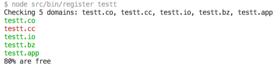

# expensive

[](https://badge.fury.io/js/expensive)


`expensive` is a [namecheap.com](https://namecheap.com) client to check domain availability, register domains, create Route 53 record zones and control domains' name servers via the CLI. The package significantly reduces the chore associated with performing these routine operations when creating new websites.

```sh
# install node with nvm https://github.com/creationix/nvm
npm i -g expensive
```

The CLI client can also perform web-based authentication via Chrome's automation to white-list IP addresses (useful when having dynamic IPs).

## Settings

Upon the first run the program will ask a series of questions:

```fs
username: <namecheap-username>
api key https://ap.www.namecheap.com/settings/tools/apiaccess/: <api key accessed at the given page>
client ip [10.10.10.10]: <the ip>
```

After they've been answered, `expensive` will remember the answers and store them in `.expensiverc` file in the home directory, and use this data for all subsequent calls to the API. These are also available to other programs which want to use the API and can be read with `getConfig` when using the package programmatically (see below).

There are additional questions which are required for specific features:

```
Last 3 digit of phone to use for 2 factor auth: <055>
AWS access key id: <aws-key-id>
AWS secret access key: <aws-key>
```

These are stored in the `.expensive-client.rc` and are not shared with other software.

The last 3 digits will be used to automatically login and white-list an IP address, and AWS keys are used for Route 53 access.

## Reporting

To see the status of all domains printed in the console, use the info extension (`-i`). If google position ranking is set up with `-g domai.ne`, then the information utility will print the rank for the conditioned keyword. Visits are accessed from [demimonde.cc](https://demimonde.cc) which is an elastic search gathering engine.

```sh
expensive -i
```

| domain       | expire in | dns         | visits | google |
|--------------|-----------|-------------|--------|--------|
| example1.com | 189 days  | dns.dns.com | 550    | 3      |
|              |           |             |        |        |
|              |           |             |        |        |

## Health Check

Run a health check against a domain. This will make Chrome visit the page and check that it loads.

```sh
expensive -h example.com
```

## Route 53

Creation of the hosted zones is implemented with Route 53 API. A new hosted zone can be created for a domain, and its name servers set via namecheap API.

```sh
expensive example.com -r
# create a hosted zone and assign name servers
```

## `CLI`

The usage is as follows:

```fs
  expensive [command]

        domain          check a domain name in various tech zones
                        (.co, .cc, .io, .bz, .app)
        domain.com      check a domain name
        -h, --help      print usage information
```

```sh
expensive test
```

```fs
Checking 5 domains: test.co, test.cc, test.io, test.bz, test.app
None of the zones are available.
```

```sh
expensive testt
```



## API
<!--
The package also supports a Node.js API. The authentication is completed in the same way as the CLI, that is by reading the `.expensiverc` file or presenting questions. If `global` parameter is not set to true, and the `packageName` is not given, the function will throw. You must provide either a `packageName` or set `global` to true so that the `~/.expensiverc` can be read. N-O-N-E-T-H-E-L-E-S-S it is a good idea to provide a `packageName` so that a personal config in form of `.${packageName}-expensiverc` is generated. -->

On top of the CLI application, the package provides means to query _namecheap_ API.

### `getConfig(options: Object)`

Reads the `rc` file (or ask questions to create one) for given details: if `global` is set to true, the `HOME/.expensiverc` is looked up, and if `packageName` is provided, the `rc` file at `.${packageName}-expensiverc` is used for storing and reading of configuration. This makes possible for other libraries to refer to the same `rc` file with the API key, or have separate configurations.

- `packageName`: name of the package implementing `expensive`, or
- `global`: a boolean to indicate that the global `.expensiverc` should be used
- `opts`: other options accepted by [`africa`](https://npmjs.org/package/africa).

The `rc` file will only contain the following details required for API calls:

```sh
{
  "ApiUser": "namecheap_user",
  "ApiKey": "api_key_from_tools",
  "ClientIp": "10.10.10.10"
}
```

Client IP does not seem to have to be correct, although it has to be present and non-white-listed IPs won't work.

### `checkDomains`

This method returns a list of free domains for the request. Either domains, or a single domain must be passed. The method also expects to see Auth details (from the config object), and these can be passed by using the destructuring.

- `domains` an array of domains
- `domain` a single domain

```js
/* example/example.js */
/* yarn example/ */
import { getConfig, checkDomains } from 'expensive'
import { debuglog } from 'util'

const LOG = debuglog('expensive')
const DEBUG = /expensive/.test(process.env.NODE_DEBUG)

const domains = process.argv.slice(3)

if (!domains.length) {
  console.log('Please enter a domain or domains')
  process.exit()
}

(async () => {
  try {
    // use `.expensive-example.rc` file to get configuration data
    // pass `global` to read `.expensiverc` instead
    const Auth = await getConfig({ packageName: 'example' })

    console.log('Checking %s', domains.join(', '))
    const res = await checkDomains({
      ...Auth,
      domains,
    })
    if (res.length) {
      console.log('The following are free: %s', res.join(', '))
    } else {
      console.log('All domains are taken.')
    }
  } catch ({ stack, message }) {
    DEBUG ? LOG(stack) : console.error(message)
    process.exit(1)
  }
})()
```

```sh
yarn example/ test.co testt.co testtt.co
```

```sh
# yarn expansions
yarn run v1.7.0
yarn e example/example.js test.co testt.co testtt.co
node example example/example.js test.co testt.co testtt.co
```

```fs
Checking test.co, testt.co, testtt.co
The following are free: testtt.co
✨  Done in 3.04s.
```

## Security

When white-listing the IP addresses via the Chrome automation script, `expensive` will use the username stored in the config file, and ask for the password. The password is not stored anywhere apart from the program's memory and then used for authorisation on the `namecheap.com` website, and as a confirmation password when adding a new white-listed IP address.

You can install the package from github after you're happy with the source code, using the following command:

```sh
npm i -g artdecocode/expensive#v1.2.0
```

This will fetch the package from GitHub, and not registry. If it was possible to see the git sha sum of the commit in `yarn info package` then it would not have been necessary, because one can compare source code against the commit number. By installing from GitHub directly, one can know what they install.

<!-- You should inspect the source code of this package and possibly install from the source code and not npm with the following command.

```sh
npm i -g artdecocode/expensive#v1.1.0
``` -->

## Errors and Troubleshooting

`expensive` will display an error text when an error happens during its execution.

### `getaddrinfo ENOTFOUND api.namecheap.com api.namecheap.com:443`

This error means that there's no internet access.

Check that the computer is connected to the internet.

---

(c) [Art Deco Code][1] 2018

[1]: https://artdeco.bz
