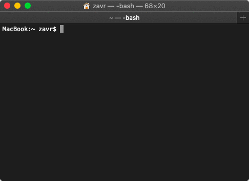

[](https://bit.ly/31boSJg)

# expensive

[](https://npmjs.org/package/expensive)

`expensive` is a [namecheap.com](https://bit.ly/31boSJg) client to check domain availability, obtain WHOIS information, register domains, update DNS hosts and control domains' name servers via the CLI. It allows to login using 2-factor authentication and white-list IP addresses without having to use the web interface. The package uses the [API](https://github.com/rqt/namecheap) and [Web API](https://github.com/rqt/namecheap-web) libraries to make requests.

| Package Manager |          Command          |
| --------------- | ------------------------- |
| Yarn            | yarn global add expensive |
| Npm             | npm i -g expensive        |



## Table Of Contents

- [Table Of Contents](#table-of-contents)
- [Configuration](#configuration)
- [Sandbox](#sandbox)
- [CLI](#cli)
- [Result Log](#result-log)
- [Copyright](#copyright)

<p align="center"><a href="#table-of-contents">
  
</a></p>

## Configuration

Upon the first run the program will ask a series of questions:

```fs
Username: <namecheap-username>
Api key https://ap.www.namecheap.com/settings/tools/apiaccess/: <api key>
Client ip [10.10.10.10]: <the ip>
Last 3 digit of phone to use for 2 factor auth: <055>
```

After they've been answered, `expensive` will remember the answers and store them in the `.expensiverc` file in the home directory (or `.expensive-sandboxrc`), and use this data for all calls to the API.

Client IP is required for requests, but if not given, it will be acquired automatically each time prior to calls.

The last 3 digits will be used to during the second-stage of the 2-factor web auth required to white-list unknown IP addresses.

<p align="center"><a href="#table-of-contents">
  
</a></p>

## Sandbox

To use the `sandbox` version of the app for testing, either the `SANDBOX` environmental variable needs to be set, or `--sandbox` or `-s` flags should be passed.

<p align="center"><a href="#table-of-contents">
  
</a></p>

## CLI

The program can be used from the terminal.

```sh
expensive -h
```

```fs
expensive
A CLI application to access namecheap.com domain name registrar API.

	domains          	The domain name for operations, or multiple domain names
	                 	for checking availability.
	--init, -I       	Initialise package configuration interactively, i.e.,
	                 	the API key and ip address.
	--info, -i       	Show the information for the domain.
	--register, -r   	Register the domain.
	--github, -g     	Setup GitHub pages for the apex domain as per docs
	                 	https://git.io/fjyr7 Also removes the parking page
	                 	and URL redirect. All other hosts are kept itact.
	--whois, -w      	Display brief WHOIS data.
	--Whois          	Display full WHOIS data.
	--coupon         	Find this month's coupon.
	--sandbox, -s    	Use the sandbox API.
	--whitelistIP, -W	Add current IP address to the list of white-listed ones.
	--version, -v    	Display the current version number.
	--help, -h       	Show help information.

expensive domain.com --info
Display the information about the domain on the account.
Also displays DNS hosts if using Namecheap's DNS.

expensive
Print the list of domains belonging to the account.

	--sort, -S    	Sort by this field (name, expire, create).
	--desc, -D    	Sort in descending order.
	--filter, -F  	Filter by this word.
	--pageSize, -P	The page size.
	--type, -T    	Domain type (ALL, EXPIRING, EXPIRED).

expensive domain.com -r [-p PROMO]
Register the domain name. Expensive will attempt to find the promo
code online, and compare its price to the normal price.

	--promo, -p	Use this promo code on registration.
	--years, -y	The number of years that the domain should be registered for.

expensive domain|domain.com [domain.org] [-f] [-z app,page]
Check domains for availability. When no TLD is given,
com, net, org, biz, co, cc, io, bz, nu, app, page are checked.

	--free, -f 	Display only free domains.
	--zones, -z	Check in these zones only.
```


|               Command               |                             Meaning                             |                                        Wiki                                        |
| ----------------------------------- | --------------------------------------------------------------- | ---------------------------------------------------------------------------------- |
| `expensive`                         | List all domains.                                               | <kbd>📜[List Domains](../../wiki/List%20Domains)</kbd>                             |
| `expensive hello world example.com` | Check domain(s)' availability.                                  | <kbd>✅[Check Availability](../../wiki/Check%20Availability)</kbd>                  |
| `expensive example.com -i`          | Display information about a domain associated with the account. | <kbd>ℹ️[Domain Information](../../wiki/Domain%20Information)</kbd>                 |
| `expensive example.com -w`          | Request WHOIS data.                                             | <kbd>👁[Show Whois](../../wiki/Whois)</kbd>                                        |
| `expensive example.com -r`          | Register a domain name.                                         | <kbd>💵[Registration](../../wiki/Registration)</kbd>                               |
| `expensive --init`                  | Initialises or updates settings such as API key.                | <kbd>🔏[Initialise Config](../../wiki/Initialise-Config)</kbd>                     |
| `expensive domain.com --github`     | Updates hosts records to include GitHub apex records.           | <kbd> [GitHub Pages](../../wiki/GitHub)</kbd> |
| `expensive --version`               | Print version.                                                  | <kbd>[Version](../../wiki/Version)</kbd>                                           |
| `expensive --help`                  | Show help.                                                      | <kbd>[Usage](../../wiki/Usage)</kbd>                                               |

<p align="center"><a href="#table-of-contents">
  
</a></p>


## Result Log

A log of search queries and found free domains is written to `HOMEDIR/.expensive.log`.

<p align="center"><a href="#table-of-contents">
  
</a></p>

## Copyright

<table>
  <tr>
    <th>
      <a href="https://artd.eco">
        
      </a>
    </th>
    <th>© <a href="https://artd.eco">Art Deco</a>   2019</th>
    <th>
      <a href="https://www.technation.sucks" title="Tech Nation Visa">
        
      </a>
    </th>
    <th><a href="https://www.technation.sucks">Tech Nation Visa Sucks</a></th>
  </tr>
</table>

<p align="center"><a href="#table-of-contents">
  
</a></p>